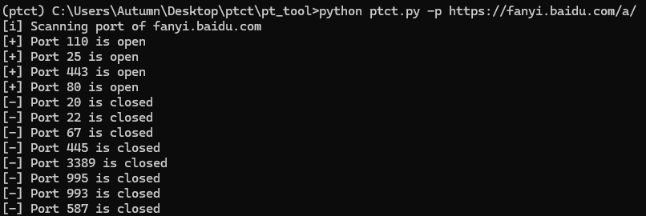
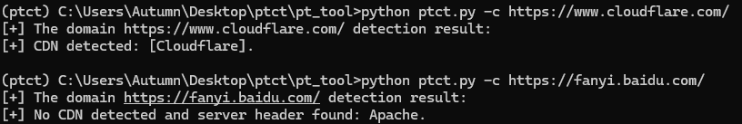
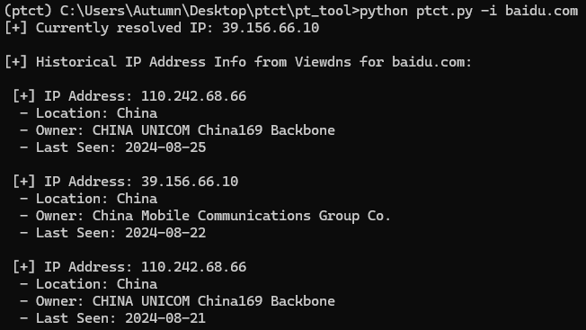
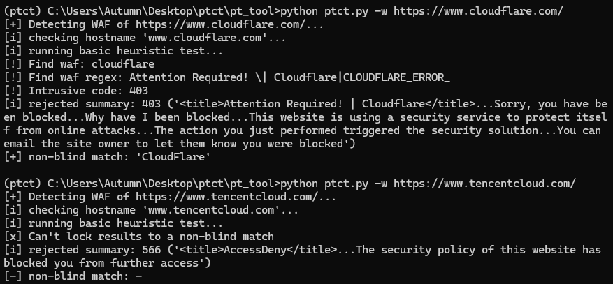
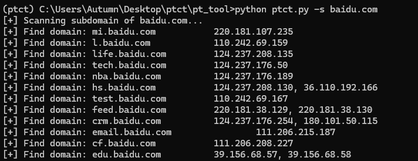

# Penetration testing comprehensive tool

----

## 基本介绍

## ptct

`ptct` 是一个网络安全工具，为安全测试和渗透测试设计。它包括以下主要功能：

- **CDN 探测**：识别指定域名是否使用了内容分发网络（CDN），并提供相关信息。
- **历史 IP 查询**：查找域名的历史 IP 地址，帮助识别过去的网络配置和潜在的变化。
- **子域名扫描**：通过暴力破解技术发现指定域名的所有子域名，提高对目标网络的了解。
- **端口扫描**：检测指定主机上的开放端口，帮助识别网络服务和潜在的安全风险。
- **WAF 探测**：识别目标网站是否使用了 Web 应用防火墙（WAF），并提供相关检测结果。

## 安装方法

python ≥ 3.10，下载到本地执行

```sh
pip install -r requirements.txt
```

## 使用方法

```bash
# python ptct.py -h
usage: ptct.py [-h] [-c CDN] [-s SUBDOMAINS] [-t THREADS] [-i IP] [-w WAF] [-p PORTSCAN]
Network security penetration testing tool
options:
  -h, --help            show this help message and exit
  -c CDN, --cdn CDN     Detect CDN
  -s SUBDOMAINS, --subdomains SUBDOMAINS
                        Brute force subdomains
  -t THREADS, --threads THREADS
                        The number of threads in the scanner
  -i IP, --ip IP        Find ip historical
  -w WAF, --waf WAF     Detect WAF
  -p PORTSCAN, --portscan PORTSCAN
                        Port scan
```

### 端口扫描

```shell
python ptct.py -p url.com
```



### CDN发现

```
python ptct.py -c url.com
```



### IP查询

```
python ptct.py -i url.com
```



### WAF分析

```
python ptct.py -w url.com
```



### 子域名扫描

```
python ptct.py -s url.com
```



### 未完成的内容

1.WAF探测功能参考identYwaf，需要进一步完善。
2.部分参数是固定值，未能从用户获取。
3.异常处理需完善。
4.实现批量检测任务。

----

